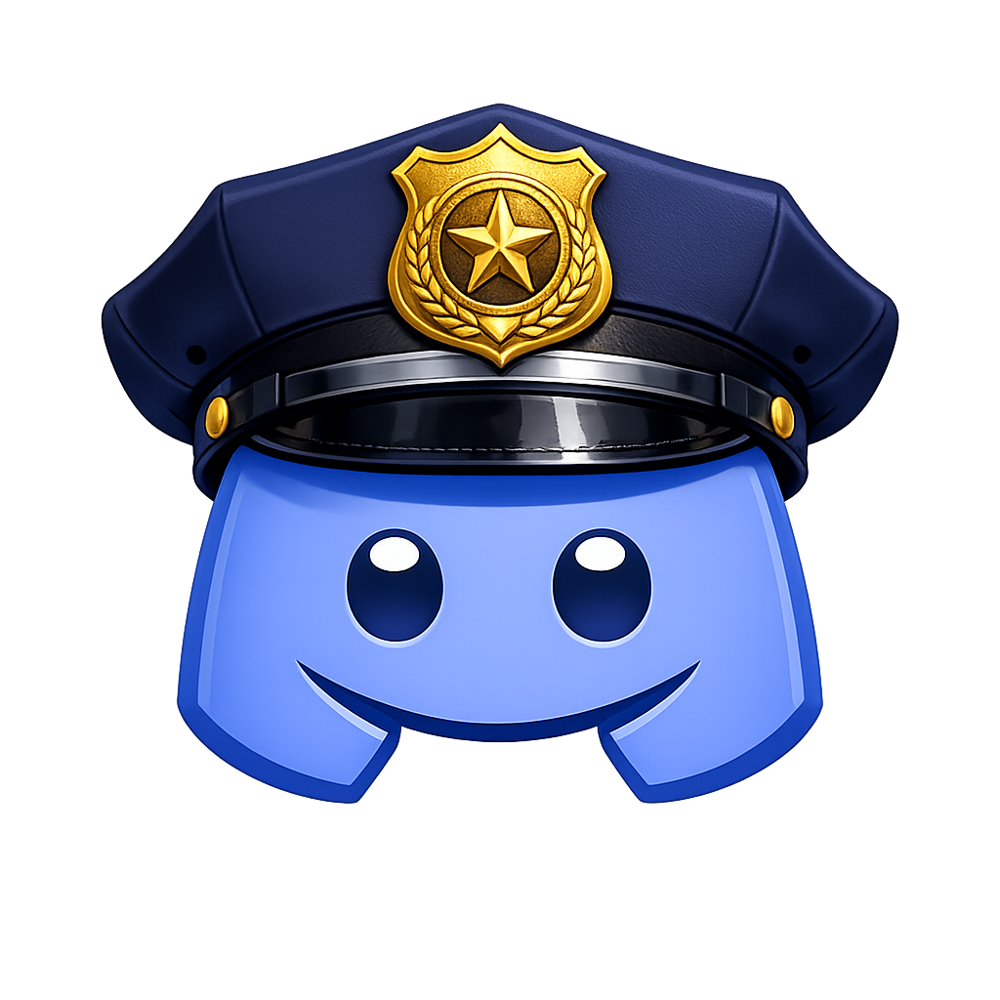

<p align="center">
  
</p>

# Discapture


https://github.com/user-attachments/assets/eaded00d-e3e5-4c3c-a5a8-4f6a83dcadff


## How it works

1. **Open Discord** -- Discapture launches Chrome or Edge with a persistent profile so your Discord login carries over between sessions.
2. **Navigate to a channel** -- In the browser window, go to the server and channel you want to capture.
3. **Begin Recording** -- Discapture scrolls up through the full message history, taking a screenshot at each step and parsing every message from the DOM.
4. **Download and save** -- Once it reaches the top of the channel, Discapture downloads all attachments and saves everything to disk as JSON or CSV.

A small control panel window stays open alongside the browser to show live progress (message count, screenshot count) and let you start/stop the capture.

## Requirements

- **Google Chrome** or **Microsoft Edge** -- must already be installed on your system. Discapture does not bundle a browser. It searches standard installation paths automatically.
- **Operating system** -- Windows 10+, macOS 10.13+, or Linux (x64 or arm64)
- **Discord account** -- you will need to log into discord in the opened window

## Download

Prebuilt installers are available on the [Releases](https://github.com/a-little-birdy/Discapture/releases) page.

## Building from source

```sh
git clone https://github.com/a-little-birdy/Discapture.git
cd Discapture
bun install
```

## Usage

Open the app after installation and follow these steps

1. Choose your output format (JSON or CSV).
2. Click **Open Discord**.
3. Wait for the browser to launch and Discord to load.
4. Navigate to the channel you want to capture.
5. Click **Begin Recording** in the control panel.
6. Wait for the capture to finish. You can stop early if needed.
7. Click **Open Folder** to view the results.

## Output

Each capture session creates a timestamped folder under the output directory (default: `~/Documents/Discapture/captures/`).

```
capture-2026-02-18T14-30-00/
  messages.json        # or messages.csv
  screenshots/
    screenshot-0001.png
    screenshot-0002.png
    ...
  attachments/
    image.png
    document.pdf
    ...
```

### JSON format

```json
{
  "capturedAt": "2026-02-18T14:30:00.000Z",
  "messageCount": 542,
  "messages": [
    {
      "id": "chat-messages-123456",
      "author": "username",
      "timestamp": "2025-12-01T10:00:00.000Z",
      "content": "message text",
      "attachments": [
        { "url": "https://cdn.discordapp.com/...", "localFile": "attachments/image.png" }
      ],
      "embeds": [],
      "screenshots": ["screenshots/screenshot-0042.png"]
    }
  ]
}
```

### CSV format

Columns: `id`, `author`, `timestamp`, `content`, `attachments`, `embeds`, `screenshots`

## Configuration

Click the gear icon in the control panel title bar to open settings.

- **Output directory** -- where capture sessions are saved. Defaults to `~/Documents/Discapture/captures/`. Use the Browse button to change it.

Your Discord login is stored in a persistent browser profile at `~/Documents/Discapture/discord-profile/` and survives between sessions. You only need to log in once.

## Building for release

```sh
BUILD_ENV=release bash scripts/build.sh
```

The release build is written to `build/release-{platform}-{arch}/Discapture/`.

On Windows, an Inno Setup installer script is available at `scripts/installer.iss` for packaging.

## Requesting features and browser support

Discapture currently supports **Google Chrome** and **Microsoft Edge**. If you would like support for another browser, or want to request a feature, please [open an issue](https://github.com/a-little-birdy/Discapture/issues).

## Tech stack

- [Electrobun](https://electrobun.dev) -- desktop application framework
- [puppeteer-core](https://pptr.dev) -- browser automation (no bundled Chromium)
- [Bun](https://bun.sh) -- JavaScript runtime and bundler
- TypeScript
